### 
Hi There!!! 
  
  

I'm a Full stack Software Developer with a knack for providing innovative solutions  
  
- 🔭 I’m currently working on freelancing

- 🥅 Current goal: Learn more about Functional Programming 

- 📬 I’m reachable via my socials  
  
- ⚡ Fun fact: I enjoy travel

 

___

### 📊 Github Stats

<table border="0"><tr><td valign="top" width="50%">
 

</td><td valign="center" width="50%">

</td></tr></table>

___

### 📊 Waka Stats

<table border="0"><tr><td valign="top" width="50%">
 
  

  
</td><td valign="top" width="50%">
  

</td></tr></table>

---

###  Tech Topics

Expand

### 🏆 Worth

Expand

---
###   Connect with Me

 

