### 
Hi There!!! 
  
  

I'm a Full stack Software Developer with a knack for providing innovative solutions  
  
- 🔭 I’m currently working with Elixir, Phoenix Framework

- 🥅 Current goal: Learn more about Functional Programming 

- 📬 I’m reachable via my socials  
  
- ⚡ Fun fact: I enjoy travel

___

### 📊 Github Stats

<picture>
  
</picture>

<picture>
  
</picture>

___

### 📊 Waka Stats

<picture>
  
</picture>

<picture>
  
</picture>

___

###  Tech Topics

Expand

### 🏆 Achievements

Expand

<picture>
  
</picture>

---
###   Connect with Me

 

